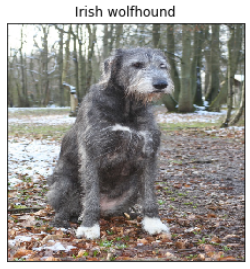
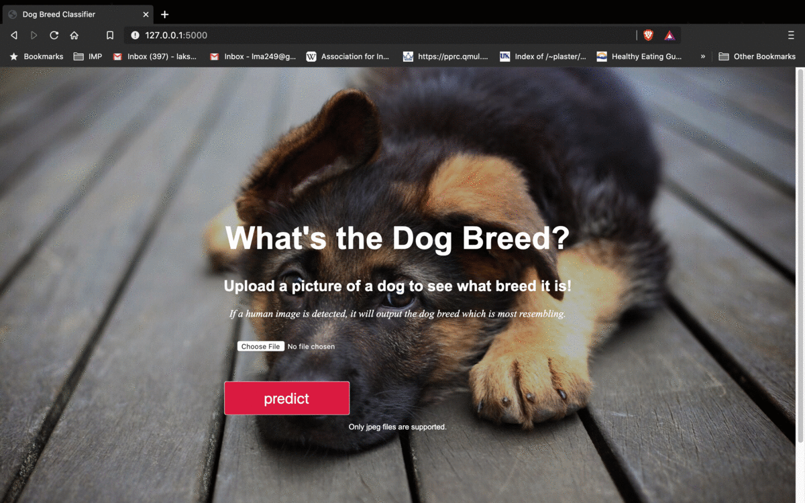
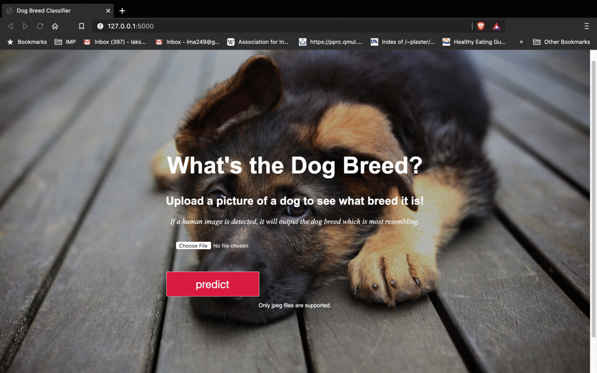

# Predicting Dog Breed 
This project is the capstone project for Udacity Data Scientist Nanodegree. In this project, I built a pipeline to process real-world, user-supplied images of dogs and humans. Given an image of a dog, our algorithm will identify an estimate of the canine’s breed. If supplied an image of a human, the code will identify the resembling dog breed. 

Along with exploring state-of-the-art CNN models for classification, we make important design decisions about the user experience. We try to deploy the model using Flask in which the user has to supply the image and the prediction will be shown. We try to analyze the challenges involved in piecing together a series of models designed to perform various tasks in a data processing pipeline. Each model has its strengths and weaknesses, and engineering a real-world application often involves solving many problems without a perfect answer. 




## Project Workflow
The first component of the project pipeline after obtaining data is to detect whether a human is present in an image. For that we use OpenCV's pre-trained face detector. If a face is detected it will draw a bounding box around the face (if needed). Then, for a dog detector, we used transfer learning using Resnet50 model. Resnet (among other classic Convolutional Neural Networks) are trained on ImageNet Dataset which has 118 different dog breeds. Our dataset has 133 dog breeds but models trained on ImageNet dataset would be good enough for our case as well.

After detecting human face and dogs in the images, we proceed to building a convolutional neural network from scratch. This model would be the baseline model for our use case and the performance of the pre-trained model will be compared with it. Since, it is just a baseline model, it doesn't have to be super complex. For the pre-trained model, we again use Resnet50 but rather than training the entire model from scratch we freeze the weights of all but the last fully connected layer. This fully connected layer has to change to accomodate the different number of classes our use case has. So we just have to train the weights of this layer and this process is refer to as [feature extraction](https://pytorch.org/tutorials/beginner/finetuning_torchvision_models_tutorial.html).

Now even humans will have hard time identifying different dog breeds. This makes it even more challenging for a computer. So given the problem has a high bayes error, our baseline model has a accuracy of about 13% which is poor by today's standards but still better than just plain guessing out of 133 dog breeds (less than 1%). Our pre-trained resnet50, model on the other hand, completely outperformed our baseline model by a huge margin. It scored an accuracy of about 88% which is still acceptable, if not great.

### Tweaking Model Hyperparameters
The two most important hyperparameters we found effecting model's performance are the `batch_size` and the `learning_rate`. 

- Batch size of 32 worked the best for our model and resulted in faster convergence. 
- For learning rate, we used a learning rate scheduler which reduces the learning rate if the validation loss doesn't improve for 8 consecutive epochs. 
- Initilaizing the weights of the last fully connected layer also improved the model performance a lot by faster convergence and lower validation loss. We use `kaiming_normal` for the weight initialization.

Once the model is trained and started making the inferences, we deploy it locally in a webapp using flask framework. The frontend of the webapp accepts the image supplied by the user. It then, posts it for inference requests to the backend which is a flask server running our trained model. The model then performs inference and send the result back to the web app from the server. The predictions are then displayed to the user.

## Getting Started
The main code is available in the __jupyter-notebook__. There are some helper modules consisting of model architecture and the scripts about dog and human-face detectors can be found in `main.py` and `utils` directory.

## Running Locally
### Clone the repo
```
$ git clone https://github.com/LakshyaMalhotra/capstone-project.git
```
### Install Requirements
__Using pip:__

```
pip install -r requirements.txt
```

__Using anaconda:__

```
conda env create -f environment.yaml
```

Make sure you have following installed:
- PyTorch
- NumPy
- Python Imaging Library (PIL)
- Matplotlib
- OpenCV
- Jupyter
- Flask

### Dataset
The dataset can be obtained by visiting these links for [dog dataset](https://s3-us-west-1.amazonaws.com/udacity-aind/dog-project/dogImages.zip) and [human dataset](https://s3-us-west-1.amazonaws.com/udacity-aind/dog-project/lfw.zip).

### Running the webapp
Webapp can be run locally by going to the `flask-webapp` directory and running
```
python app.py
```
and then opening http://localhost:5000/ in your browser tab.

### Output
__Dog-prediction:__


__Human-prediction:__


### References
1. [Feature extraction in PyTorch](https://pytorch.org/tutorials/beginner/finetuning_torchvision_models_tutorial.html)
2. [Video on deploying PyTorch models on flask](https://www.youtube.com/watch?v=eI8m0-NWCys&t=4758s)
3. [Resnet paper](https://arxiv.org/abs/1512.03385)
4. [Weight initialization](https://pytorch.org/docs/stable/nn.init.html#torch.nn.init.kaiming_normal_)
5. [CSS Styling](https://heartbeat.fritz.ai/brilliant-beginners-guide-to-model-deployment-133e158f6717)
6. [Webapp background](https://www.google.com/imgres?imgurl=https%3A%2F%2Fwallpaperset.com%2Fw%2Ffull%2Fd%2F6%2Fc%2F289442.jpg&imgrefurl=https%3A%2F%2Fwallpaperset.com%2Fcool-dogs-wallpapers&tbnid=QDfuwFpYtHBB3M&vet=12ahUKEwjq2qHB1MPpAhXEZ60KHTWgBEoQMygRegUIARC2Ag..i&docid=NkktpINYB6WeEM&w=1920&h=1280&q=dog%20wallpapers&ved=2ahUKEwjq2qHB1MPpAhXEZ60KHTWgBEoQMygRegUIARC2Ag)


